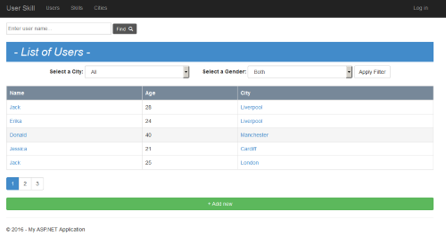

# CRUD-Authorize-App
Simple application using Asp.Net MVC, which contains CRUD functionality.

### About

Project on ASP.NET MVC to provide CRUD functionality into the HTML-tables. Also there are implemented a simple system of user authentication. Common features:  

<ol>
<li> Ability to create, read, update and delete data using ASP.NET MVC and Javascript. </li>
<li> Custom IRepository implementation. </li>
<li> Procedure of user authorization. </li>
<li> Entity Framework as the main database, relationships "one-to-many" & "many-to-many". </li>
</ol>  

### Screenshot

